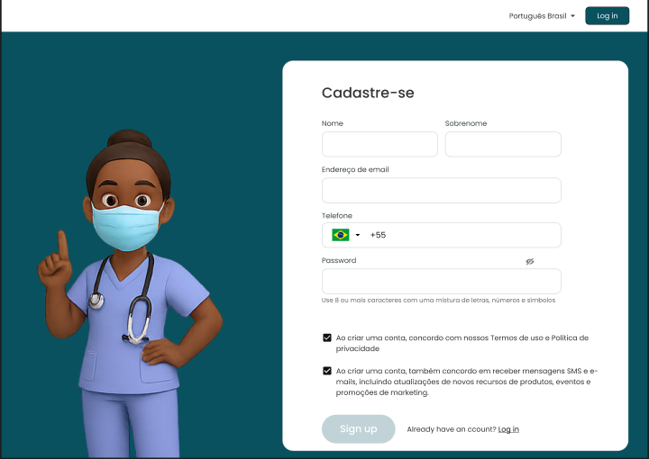

# 🧠 Saúde Inteligente — Sistema de Análise Médica com IA

Projeto desenvolvido como parte do **Trabalho de Conclusão de Curso (TCC)** em **Ciência da Computação** — **Universidade Paulista (UNIP)**.

O **Saúde Inteligente** é um sistema web completo que integra **Frontend (HTML, CSS, JS)** e **Backend (Python + FastAPI)** para simular o processo de **análise de exames médicos com inteligência artificial**.  
O projeto foi projetado para demonstrar conceitos de **automação, usabilidade e integração entre sistemas web e APIs modernas.**

---

## 🚀 Visão Geral

O sistema permite que usuários:
- Se cadastrem e façam login com autenticação via **JWT**;
- Façam upload de exames em **PDF, PNG, JPG, HEIC, CSV, XLS ou XLSX**;
- Recebam uma **análise automatizada simulada** (Bom, Regular ou Ruim);
- Interajam com uma interface moderna, responsiva e intuitiva.

---

## 🏗️ Arquitetura do Projeto

```bash
TCC-Code/
│
├── saude_inteligente_backend_starter/     # Backend (FastAPI)
│   ├── app/
│   │   ├── main.py                        # Configurações principais e CORS
│   │   ├── routers/                       # Rotas (auth e upload)
│   │   ├── models.py, schemas.py          # Modelos e validações
│   │   ├── database.py                    # Conexão SQLite
│   │   ├── analysis.py                    # Simulação de análise de exames
│   │   └── config.py                      # Configuração da aplicação
│   └── requirements.txt                   # Dependências Python
│
├── saude-inteligente/                     # Frontend (HTML, CSS e JS)
│   ├── src/assets/views/                  # Páginas: login, cadastro, upload
│   ├── src/assets/js/                     # Scripts de interação e autenticação
│   ├── src/assets/css/                    # Estilos organizados por página
│   └── index.html                         # Página inicial
│
└── README.md                              # Documentação do projeto

---

## 🧩 Funcionalidades

✅ **Cadastro e Login de Usuários**  
- Criação de conta com e-mail e senha.  
- Login com token JWT armazenado no navegador.  

✅ **Upload de Exames**  
- Upload de arquivos locais (.pdf, .jpg, .png, etc.).  
- Simulação de análise de resultado com mensagem de retorno.  

✅ **Interface Amigável e Responsiva**  
- Design inspirado em plataformas de telemedicina.  
- Feedbacks visuais (alertas e pop-ups) em cada etapa.  

✅ **Integração Completa via Ngrok**  
- Comunicação entre backend (localhost:8000) e frontend (localhost:5500).  

---

## ⚙️ Tecnologias Utilizadas

| Camada | Tecnologia | Descrição |
|--------|-------------|-----------|
| Backend | **Python 3.12 + FastAPI** | Framework moderno e de alta performance |
| Banco de Dados | **SQLite + SQLAlchemy** | Banco local leve e integrado |
| Frontend | **HTML5, CSS3, JavaScript** | Interface e lógica de interação |
| Conectividade | **Ngrok** | Exposição segura do backend local |
| Segurança | **JWT (JSON Web Token)** | Autenticação moderna e segura |
| Versionamento | **Git + GitHub** | Controle de versão e colaboração |

---

## 🧠 Metodologia

1. **Planejamento e Arquitetura:** definição do fluxo de usuário, rotas e estruturas.  
2. **Desenvolvimento incremental:** testes e ajustes em ciclos curtos.  
3. **Testes de usabilidade:** verificação de interface e experiência do usuário.  
4. **Integração e validação final:** uso de Ngrok para conectar backend e frontend.  
5. **Documentação completa:** README, prints de tela e relatório final do TCC.  

---

## 🧪 Resultados e Prints

### 🔐 Login


### 🧾 Cadastro


### 📤 Upload de Exame


### ✅ Resultado da Análise


---

## 🧰 Como Executar Localmente

### 1️⃣ Clonar o repositório
```bash
git clone https://github.com/iamkaued/saude-inteligente.git
cd TCC-Code

2️⃣ Rodar o Backend (FastAPI)

cd saude_inteligente_backend_starter
python3 -m venv .venv
source .venv/bin/activate
pip install -r requirements.txt
uvicorn app.main:app --reload

A API ficará disponível em:
👉 http://127.0.0.1:8000/docs

3️⃣ Rodar o Frontend

Abra o arquivo:

/saude-inteligente/src/assets/views/login.html

no navegador (ou use a extensão Live Server no VS Code).

⸻

💬 Autor

👤 Kauê Eduardo
📧 kaue.ke19@gmail.com
💼 LinkedIn
💻 GitHub

⸻

🏁 Licença

Este projeto é de uso acadêmico e está licenciado sob a licença MIT.
Sinta-se livre para estudar, adaptar e evoluir o código.

⸻

Desenvolvido como parte do TCC do curso de Ciência da Computação — UNIP, 2025.

